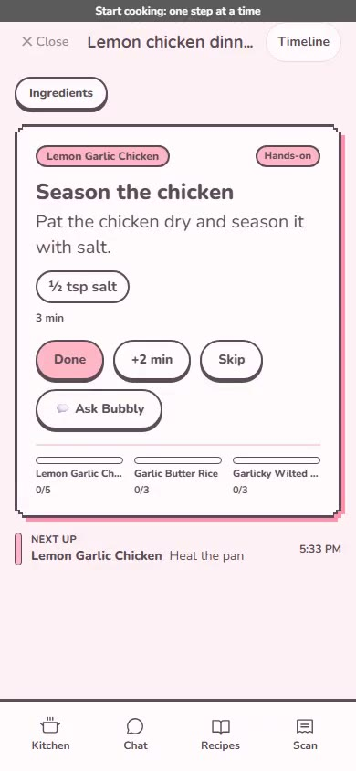

# BubblyChef

A Sanrio-inspired pantry + recipe assistant. Plain Gemini can write you a recipe; BubblyChef writes one that is grounded in what is actually in your kitchen, plans a whole meal with a cook-along timeline, and deducts what you used when you are done.

**Live:** https://bubbly-chef.vercel.app

[](demos/milestones/bubblychef-tour.mp4)

The 1:46 phone-sized tour above covers scan, chat, meal, cook-along, deduction, grocery and library ([`bubblychef-tour.mp4`](demos/milestones/bubblychef-tour.mp4); more in [`demos/milestones/`](demos/milestones/README.md)). Earlier demo: [YouTube](https://youtu.be/0r-LrfWgBrk).

---

## Features

- **Scan a receipt, put it away.** Gemini Vision reads the receipt; you review what it found, then each item hops into its place in the pixel kitchen. Nothing is written until you tap "Put away".
- **A kitchen you can see.** The home screen is a pixel dollhouse wall with a storage place per area (fridge, freezer, pantry, basket). Items nearing expiry are tagged right on the wall.
- **Chat with Bubbly.** Pantry-aware recipes and whole-meal options (a main plus sides), grounded in your stock and what is expiring.
- **Meal plan and cook-along.** Pick a meal and get an interleaved timeline across dishes, then cook step by step with timers and an "Ask Bubbly" sheet.
- **One-tap deduction.** When you finish, review what you used and the pantry updates in one go.
- **Grocery list.** Built from what a meal or recipe is missing; check off, edit, share.
- **Recipe library.** Search saved recipes and meals; favorites apply to recipes.
- **Rescue before expiry.** "Use it first" surfaces what is about to go off; using or rescuing it earns bubbles, the in-app currency that unlocks kitchen decorations and themes.

---

## Stack

| Layer | Tech |
|---|---|
| Frontend + CRUD | Next.js 16 (App Router), React, TypeScript, Tailwind CSS v4 |
| Auth + Database | Supabase (Postgres 15 + Row Level Security) |
| AI microservice | FastAPI + LangGraph + Gemini API (Ollama fallback) |
| Client state | React Query (server state), React hooks/context |
| Styling | Tailwind + Framer Motion, Nunito |
| Deployment | Vercel (frontend) + Railway (AI service) |

## Architecture

```
Browser
  |
  +-- Next.js API routes (/api/*) --> Supabase Postgres (RLS per user)
  |     pantry, recipes, profile, decorations, foods
  |
  +-- AI microservice (/v1/*) -----> Supabase (service_role, explicit user_id)
        chat, scan, recipe + meal generation
        LangGraph workflows, Gemini Vision OCR
        Gemini --> Ollama fallback
```

- CRUD goes through same-origin Next.js routes; AI work goes straight to the microservice (SSE for chat).
- AI workflows return proposals with confidence scores. Nothing writes to the database without the user confirming.
- Every table carries `user_id` with RLS.

More in [`docs/ARCHITECTURE.md`](docs/ARCHITECTURE.md).

## Quick start

Needs Node.js 20+, Python 3.11+, a free [Supabase](https://supabase.com) project and a [Gemini API key](https://aistudio.google.com/).

```bash
git clone https://github.com/ayushb3/BubblyChef
cd BubblyChef
cd nextjs && npm install
cd ../ai-service && pip install -e ".[dev]"
```

Configure `nextjs/.env.local` and `ai-service/.env` (variable names are in [`CLAUDE.md`](CLAUDE.md#environment-variables); Supabase setup in [`docs/SUPABASE_SETUP.md`](docs/SUPABASE_SETUP.md)), apply migrations with `supabase db push`, then:

```bash
cd nextjs && npm run dev                                              # http://localhost:3000
cd ai-service && uvicorn bubbly_chef.main:app --reload --port 8888    # AI service
```

Checks:

```bash
cd ai-service && pytest && ruff check bubbly_chef/
cd nextjs && npx tsc --noEmit
```

## Built with an autonomous Claude agent team

BubblyChef is built by a team of Claude agents (PM, backend, frontend, UI/UX, QA/review) that pick up GitHub issues, open PRs, and merge on green CI plus a review. How that works: [`WORKFLOW.md`](WORKFLOW.md).
