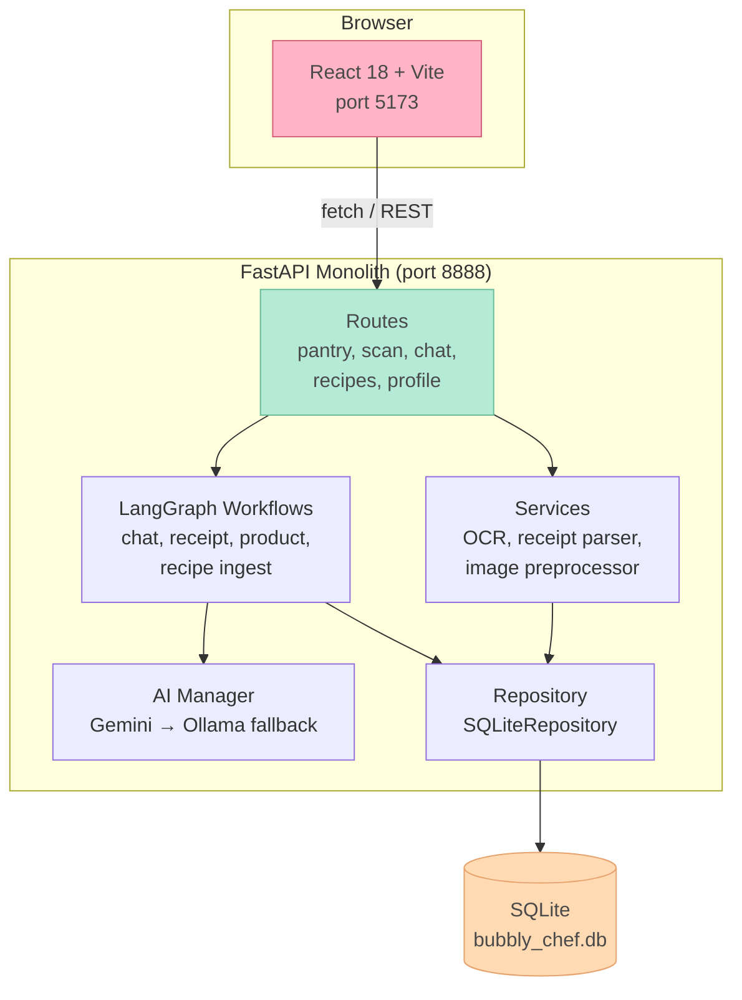
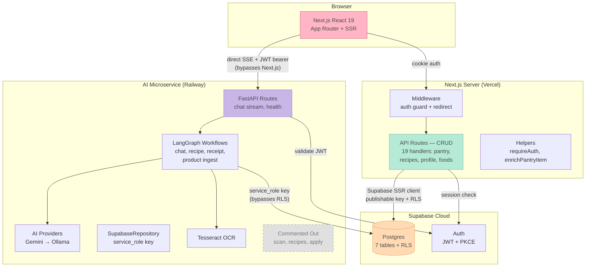
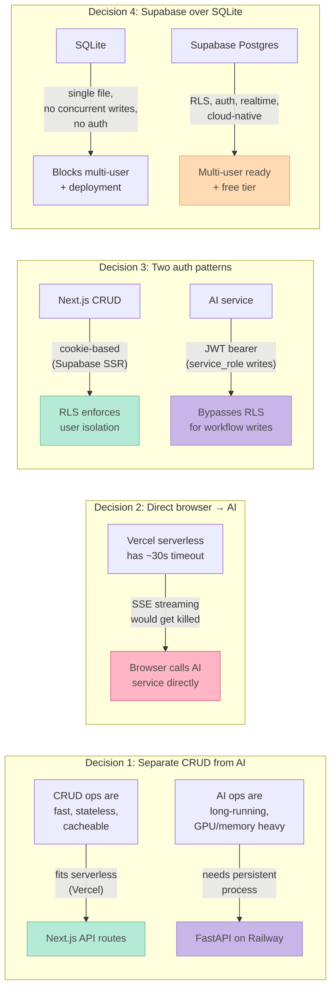

# BubblyChef Architecture: Old vs New

## Summary

BubblyChef migrated from a React+Vite/FastAPI+SQLite monolith to a split-service architecture: Next.js (CRUD + SSR) + FastAPI AI microservice + Supabase (Postgres + Auth). This document captures both architectures side-by-side with Mermaid diagrams and explains the design decisions behind the migration.

---

## Old Architecture (Monolith)

Everything in one FastAPI process. React app talks to one backend, one database, one deployment unit. Simple, but everything scales (or breaks) together.



### Old Stack

| Layer | Tech |
|---|---|
| Frontend | React 18 + Vite (port 5173) |
| Backend | FastAPI (port 8888) — routes, services, workflows, AI, repo all in one process |
| Database | SQLite via aiosqlite |
| AI | Gemini API + Ollama fallback, managed by `AIManager` |
| Migrations | Alembic |

---

## New Architecture (Split Services)

Three independently deployable services sharing Supabase as the data layer.



### New Stack

| Layer | Tech | Deploys to |
|---|---|---|
| Frontend + CRUD API | Next.js 14 (App Router, React 19) | Vercel |
| AI Microservice | FastAPI + LangGraph + Tesseract | Railway |
| Database | Supabase Postgres (7 tables, RLS) | Supabase Cloud |
| Auth | Supabase Auth (JWT + PKCE) | Supabase Cloud |

---

## Design Decisions



### Decision 1: Separate CRUD from AI

CRUD operations (pantry list, recipe save, profile update) are fast, stateless, and cacheable — perfect for Vercel's serverless model. AI operations (LLM calls, OCR, LangGraph workflows) are long-running and memory-heavy — they need a persistent process on something like Railway.

### Decision 2: Direct browser-to-AI connection

Vercel serverless functions have a ~30 second timeout. Chat streaming via SSE can run much longer than that. Rather than fighting the platform, the browser calls the AI microservice directly for streaming endpoints. Non-streaming AI calls could optionally be proxied through Next.js API routes later.

### Decision 3: Two auth patterns

- **Next.js CRUD** uses cookie-based auth via Supabase SSR. Row-Level Security (RLS) on Postgres enforces user isolation automatically — the API routes don't need manual `WHERE user_id = ...` filters.
- **AI microservice** validates the same JWT from the cookie, but writes to the DB using a `service_role` key that bypasses RLS. This is necessary because LangGraph workflows write on behalf of users from a backend context where RLS cookie auth doesn't apply.

### Decision 4: Supabase over SQLite

SQLite was fine for local development but blocked multi-user support and cloud deployment (single-file DB, no concurrent writes, no built-in auth). Supabase provides Postgres with RLS, built-in auth (email/password, OAuth), realtime subscriptions, and a generous free tier.

---

## Data Flow Patterns

### CRUD (pantry, recipes, profile)
```
Browser → Next.js API route (cookie auth)
    → Supabase Postgres (publishable key + RLS)
```

### AI Chat (streaming)
```
Browser → AI service directly (JWT bearer + SSE)
    → LangGraph workflow → Gemini/Ollama
    → Supabase Postgres (service_role key, bypasses RLS)
```

### AI Non-streaming (scan, recipe gen — future)
```
Browser → Next.js proxy route /api/ai/* (cookie auth)
    → AI service (internal, JWT forwarded)
    → Supabase Postgres (service_role key)
```

---

## Migration Status (as of 2026-04-08)

| Phase | Status |
|---|---|
| Supabase schema + RLS + auth | Done |
| Next.js app + auth + CRUD API routes | Done |
| AI service extraction + chat streaming | Done |
| Wire remaining AI endpoints (scan, recipes, apply) | TODO |
| Port UI components from old React app | TODO |
| Next.js → AI proxy routes | TODO |
| Deployment (Vercel + Railway + Supabase) | TODO |
| CI/CD pipeline | TODO |

**Estimated completion: ~70%** — all infrastructure and core APIs are done; UI components and deployment remain.

---

## References

- `docs/MIGRATION_SUMMARY.md` — Phase-by-phase migration log
- `docs/ARCHITECTURE.md` — Full architecture reference
- `docs/SUPABASE_SETUP.md` — Supabase setup guide
- `supabase/migrations/` — Database schema + RLS policies
- `nextjs/src/app/api/` — All CRUD route handlers
- `ai-service/bubbly_chef/` — AI microservice code
