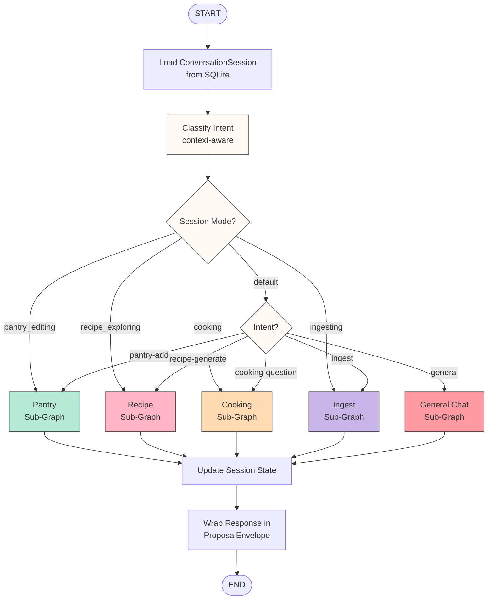
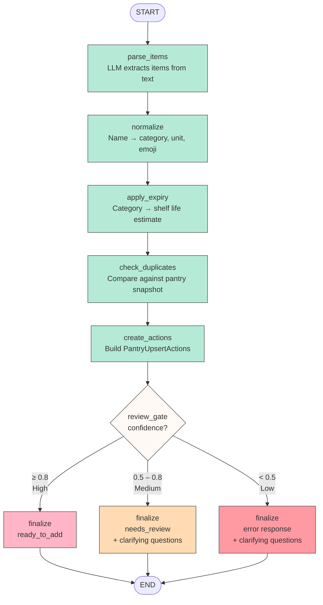
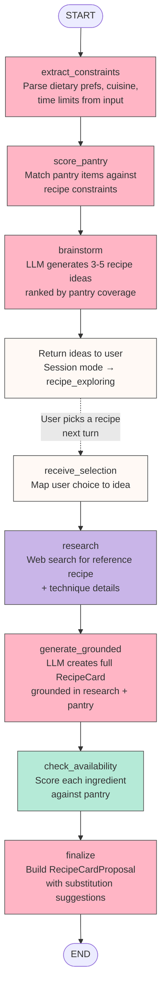
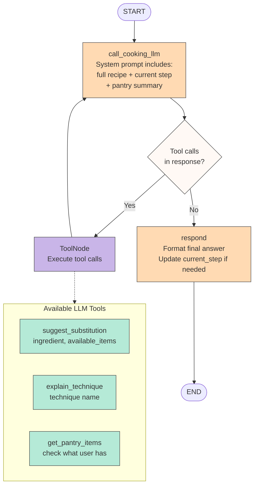
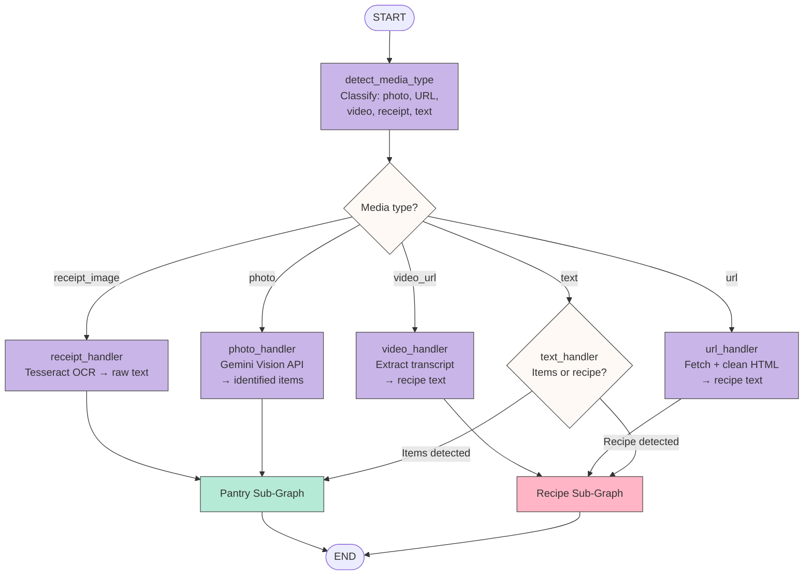
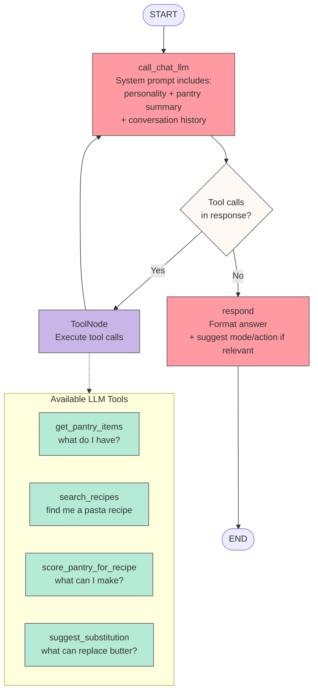

# AI Workflow Diagrams

Visual Mermaid diagrams for the BubblyChef AI workflow architecture redesign.
See `2026-03-30-ai-workflows-architecture-redesign.md` for full specs.

---

## 1. Parent Router Graph

The router loads the conversation session, classifies intent (with session mode as a fast-path),
dispatches to the correct sub-graph, then wraps the response.

**Key pattern:** Session mode acts as a fast-path. If the user is mid-flow (cooking, exploring recipes, etc.), the router skips LLM classification entirely and routes directly. Only in `default` mode does it run the full keyword → LLM intent classification.

---

## 2. Pantry Sub-Graph

A deterministic pipeline — no LLM tool-calling loop. Each node calls shared tools directly.
Branching happens only at the review gate based on confidence thresholds.

**Key pattern:** This is a **linear pipeline** — the simplest LangGraph topology. Compare with the Cooking and General Chat sub-graphs which use the **ReAct loop** pattern (LLM ↔ ToolNode cycle).

**Confidence thresholds:**
- `≥ 0.8` — items are ready to add (user just confirms)
- `0.5 – 0.8` — items need review (user edits before confirming)
- `< 0.5` — too ambiguous, ask clarifying questions

**Shared tools called by nodes:**
| Node | Tool |
|------|------|
| parse_items | `parse_items(text)` → LLM structured output |
| normalize | `normalize_item(name)` → category, unit, emoji |
| apply_expiry | `estimate_expiry(item)` → shelf life |
| check_duplicates | `check_duplicates(items, pantry)` → dedup result |
| create_actions | (internal) builds `PantryUpsertAction` list |
| review_gate | (internal) checks aggregate confidence |
| finalize | (internal) wraps into `PantryProposal` |

---

## Diagram Legend

| Color | Meaning |
|-------|---------|
| 🟢 `#b5ead7` (mint) | Pantry / processing nodes |
| 🩷 `#ffb5c5` (pink) | Recipe / success path |
| 🟠 `#ffdab3` (peach) | Cooking / review path |
| 🟣 `#c9b5e8` (lavender) | Ingest |
| 🔴 `#ff9aa2` (coral) | General Chat / error path |
| ⬜ `#fff9f5` (cream) | Decision / routing nodes |

## 3. Recipe Sub-Graph

Multi-stage pipeline with a **user interaction break** — brainstorm presents options, user picks one,
then the graph continues with research and generation. Uses shared tools directly (no ReAct loop).

**Key pattern:** This graph has a **session break** in the middle. After `brainstorm`, the response goes back to the user and the session mode is set to `recipe_exploring`. When the user replies with their pick, the router fast-paths back into this sub-graph at `receive_selection`. This is a form of **human-in-the-loop** — the graph pauses for user input, then resumes.

**Shared tools called by nodes:**
| Node | Tool |
|------|------|
| extract_constraints | (internal) parse user message + profile prefs |
| score_pantry | `score_pantry_for_recipe(constraints)` |
| brainstorm | LLM call via `AIManager.complete()` |
| research | `search_recipes(query, cuisine)` |
| generate_grounded | LLM call via `AIManager.complete()` with research context |
| check_availability | `score_pantry_for_recipe()` per ingredient |
| finalize | (internal) wraps into `RecipeCardProposal` |

---

## 4. Cooking Sub-Graph (ReAct Pattern)

The first **agentic** sub-graph — uses the ReAct loop where the LLM decides which tools to call.
Active when a user is cooking a pinned recipe and asking questions.

**Key pattern:** This is the **ReAct loop** from the video. The LLM calls → checks if it wants tools → executes tools → feeds results back to LLM → repeat until the LLM responds without tool calls. LangGraph's `ToolNode` handles the tool execution automatically.

**Why ReAct here?** The cooking companion needs to dynamically decide: "Should I check the pantry for a substitution, or just answer the question directly?" That decision is best left to the LLM, not hardcoded.

---

## 5. Ingest Sub-Graph (Unified)

Routes different media types through specialized handlers, then delegates to
Pantry or Recipe sub-graphs for the actual processing.

**Key pattern:** This is a **fan-out router** — one entry point, multiple specialized handlers, converging back into existing sub-graphs. The Ingest graph doesn't duplicate Pantry or Recipe logic; it delegates. This is **sub-graph composition** — a graph calling other graphs.

**Shared tools called by handlers:**
| Handler | Tool |
|---------|------|
| receipt_handler | `ocr_receipt(image, preprocess)` |
| photo_handler | `identify_items_from_photo(image)` (Gemini Vision) |
| video_handler | `extract_video_transcript(url)` |
| url_handler | `fetch_url_content(url)` |

---

## 6. General Chat Sub-Graph (ReAct Pattern)

The second agentic sub-graph — handles open-ended cooking questions with
tool access for pantry-aware answers.

**Key pattern:** Same ReAct loop as Cooking, but with different tools and a broader system prompt. The `respond` node can also suggest mode transitions (e.g., "Want me to help you cook that?" → sets `suggested_mode: "cooking"`), which the router picks up on the next turn.

**Cooking vs General Chat — why two ReAct sub-graphs?**
| | Cooking | General Chat |
|---|---|---|
| **Context** | Pinned recipe + current step | Open-ended, no pinned recipe |
| **Tools** | Substitution, technique, pantry | Pantry, recipe search, scoring, substitution |
| **System prompt** | Focused: "help cook this recipe" | Broad: "friendly cooking assistant" |
| **Session mode** | `cooking` (sticky until exit) | `default` (no sticky mode) |

---

## Graph Topology Summary

| Sub-Graph | Topology | LLM Tool Access | Session Break |
|-----------|----------|-----------------|---------------|
| Pantry | Linear pipeline | No (deterministic) | No |
| Recipe | Pipeline with break | No (deterministic) | Yes (brainstorm → user picks) |
| Cooking | ReAct loop | Yes (3 tools) | No |
| Ingest | Fan-out router | No (delegates to other sub-graphs) | No |
| General Chat | ReAct loop | Yes (4 tools) | No |

---

## Diagram Legend

| Color | Meaning |
|-------|---------|
| `#b5ead7` (mint) | Pantry / shared tool nodes |
| `#ffb5c5` (pink) | Recipe nodes |
| `#ffdab3` (peach) | Cooking nodes |
| `#c9b5e8` (lavender) | Ingest / ToolNode execution |
| `#ff9aa2` (coral) | General Chat nodes |
| `#fff9f5` (cream) | Decision / routing nodes |
