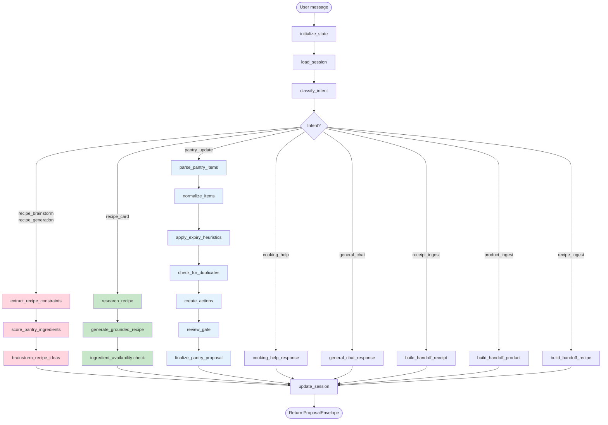

# Chat Intent Router — Full Workflow

The chat router is a LangGraph state machine that handles every user message sent to `/v1/chat`.
It classifies intent, routes to a path-specific subgraph, then converges at `update_session → END`.

---

## Entry Point

Every message enters through `run_chat_workflow_streaming()` in `router.py`.
Three setup nodes run first on every path:

```
initialize_state    assign request_id, workflow_id, zero-fill lists
      ↓
load_session        fetch or create conversation session from Supabase
                    if session is stale (>30 min idle) → reset to default mode
      ↓
classify_intent     rule-based keyword matching → LLM fallback for ambiguous cases
                    session mode can override intent (see Session Modes below)
      ↓
route_by_intent     conditional edge → one of 7 paths
```

---

## Intent Classification

`classify_intent` runs keyword checks in priority order, only falling back to the LLM if nothing matches.

| Priority | Pattern examples | Intent |
|---|---|---|
| 1 | brainstorm follow-up detected in history | `recipe_card` |
| 2 | "receipt", "uploaded receipt" | `receipt_ingest` |
| 3 | "barcode", "scan this product" | `product_ingest` |
| 4 | URL present, "save recipe", "import recipe" | `recipe_ingest` |
| 5 | "what can I make", "recipe ideas", "what to cook" | `recipe_brainstorm` |
| 6 | "recipe for", "dinner ideas", "give me a recipe" | `recipe_generation` |
| 7 | generic "recipe" with no import verbs | `recipe_generation` |
| 8 | "how to cook", "substitute for", "how do I" | `cooking_help` |
| 9 | "bought", "purchased", "threw away", "ran out" | `pantry_update` |
| 10 | everything else | LLM classification → or `general_chat` |

**Session mode override**: When a session is in `RECIPE_EXPLORING` mode, all follow-ups
are forced to `recipe_card` (or `recipe_brainstorm`) without keyword matching.
Modification phrases like "no cheese" or "make it spicier" within that session are
caught by prefix matching and routed as `recipe_card`.

**Exit phrases**: "exit", "done", "go back", "never mind" etc. always reset the session
to default and route to `general_chat`.

---

## Path Overview



---

## Path Details

### Recipe Brainstorm (pink)

Triggered by `recipe_brainstorm` or `recipe_generation` intent.

```
extract_recipe_constraints
    LLM → RecipeConstraints (cuisine, meal_type, dietary, max_time_minutes,
           preferred_ingredients, excluded_ingredients)
    if meal_type not specified → infer from time of day (breakfast/lunch/snack/dinner)
         ↓
score_pantry_ingredients
    fetch pantry from DB (or use snapshot if provided)
    deterministic scoring per item:
        expiry ≤ 3 days  → +10   (priority items)
        expiry ≤ 7 days  → +5
        cuisine keyword match → +3
        preferred_ingredients → +5
        excluded_ingredients  → -100 (filtered out)
    returns top 15 scored items
         ↓
brainstorm_recipe_ideas
    LLM → 3-4 **bold** recipe name suggestions, conversational text
    extracts bold names into brainstorm_ideas list
    session → RECIPE_EXPLORING, brainstorm_ideas stored in session.metadata
```

Returns: `general_chat` envelope with `assistant_message` + `suggested_action: pick_recipe`

---

### Recipe Card / Grounded Generation (green)

Triggered when user picks from brainstorm or sends a follow-up in `RECIPE_EXPLORING` mode.
`selected_recipe_name` is resolved via fuzzy matching against bold names in history
(ordinal words → "first"/"second", fuzzy string match via `rapidfuzz`).

```
research_recipe
    DuckDuckGo search for "{recipe_name} [cuisine]"
    stores snippet as grounding context (capped at 400 chars)
         ↓
generate_grounded_recipe
    if pantry not yet scored → fetch + score now
    LLM → full RecipeCard:
        title, description
        ingredients: name, quantity, unit, preparation, optional, substitutes
        instructions (step list)
        prep_time_minutes, cook_time_minutes, total_time_minutes
        difficulty, servings, cuisine, meal_type, dietary_tags, tips
    parses LLM output into typed Ingredient objects
    handles non-numeric quantities ("to taste") as preparation notes
         ↓
ingredient_availability
    per ingredient: check pantry names with substring matching
        "have"       → pantry contains this ingredient
        "substitute" → a substitute in ing.substitutes is in pantry
        "missing"    → not found
    computes pantry_match_score = available / total ingredients
```

Returns: `recipe_card` envelope with `RecipeCardProposal` + `ingredient_availability` metadata

---

### Pantry Update (blue)

Triggered by `pantry_update` intent. Uses 2 LLM calls (parse) + 4 deterministic steps.

```
parse_pantry_items  [LLM]
    extracts items: name, quantity, unit, category, action (add/remove/use), confidence
         ↓
normalize_items  [deterministic]
    normalizes names via domain normalizer (USDA catalog + keyword rules)
    resolves/overrides category if LLM returned "other"
    penalizes confidence: heavy normalization → ≤0.70, unknown category → ≤0.65
    computes quantity_base + unit_base for math (e.g. "1 dozen" → 12 count)
         ↓
apply_expiry_heuristics  [deterministic]
    assigns expiry_date from category-based heuristics
    assigns storage_location (pantry / fridge / freezer)
         ↓
check_for_duplicates  [deterministic]
    warns on duplicates within batch
    warns if item already exists in pantry_snapshot with action=add
         ↓
create_actions  [deterministic]
    converts normalized items → PantryUpsertAction objects
    generates client_item_key = "category:name" (deduplicated within batch)
         ↓
review_gate  [deterministic]
    determines next_action based on confidence thresholds:
        < 0.5 (review_confidence_threshold) → REQUEST_CLARIFICATION + interrupt
        0.5–0.8                             → REVIEW_PROPOSAL (show to user)
        ≥ 0.8 (auto_apply_threshold)        → NONE (auto-apply)
    builds clarifying_questions for ambiguous items
         ↓
finalize_pantry_proposal
    packages actions into PantryProposal with dedup_applied / normalization_applied flags
```

Returns: `pantry_update` envelope with `PantryProposal` + per-item confidences

---

### Cooking Help

Pantry-aware freeform cooking advice. Fetches full pantry, highlights items expiring ≤3 days.
Supports streaming (tokens yielded as SSE events, then final envelope).

Returns: `general_chat` envelope

---

### General Chat

General conversation with light pantry context (first 20 item names appended to prompt).
Detects mode-switch suggestions in the response text (e.g. "try recipe mode") and
returns `suggested_mode` hint to the frontend.
Supports streaming.

Returns: `general_chat` envelope

---

### Handoff Paths (receipt / product / recipe ingest)

These are placeholder acknowledgements — no AI calls, just a structured response
telling the frontend what to collect next.

| Path | next_action | required_inputs |
|---|---|---|
| receipt_ingest | `REQUEST_RECEIPT_IMAGE` | receipt_image |
| product_ingest | `REQUEST_PRODUCT_BARCODE` | barcode |
| recipe_ingest | `REQUEST_RECIPE_TEXT` | recipe_url, recipe_text |

Returns: `handoff` envelope (user is redirected to the appropriate upload/scan flow)

---

## Session Modes

`update_session` runs on every path before END and transitions the conversation mode.

| After intent | Session mode |
|---|---|
| `recipe_brainstorm` / `recipe_generation` | `RECIPE_EXPLORING` |
| `recipe_card` (proposal returned) | `RECIPE_EXPLORING` (stay — for refinements) |
| `pantry_update` (requires_review=True) | `INGESTING` |
| `pantry_update` (auto-apply) | `DEFAULT` |
| exit phrase | `DEFAULT` (reset) |
| `cooking_help` with brainstorm_ideas | `RECIPE_EXPLORING` |
| `cooking_help` / `general_chat` | unchanged |

Sessions stale after 30 minutes of inactivity → auto-reset to `DEFAULT`.

---

## Streaming

`general_chat` and `cooking_help` stream tokens as SSE events:
```
{"type": "token", "content": "..."}   # one per token
{"type": "done"}
{"type": "envelope", "data": {...}}   # final ProposalEnvelope
```

All other intents run the full LangGraph graph and yield a single `envelope` event.

Exception: `cooking_help` in `recipe` input mode is re-routed through the full
grounded generation pipeline instead of streaming.

---

## Key Files

| File | Role |
|---|---|
| `workflows/router.py` | Graph definition, `classify_intent`, session management, streaming |
| `workflows/recipe/nodes.py` | Recipe brainstorm + grounded generation nodes |
| `workflows/pantry/nodes.py` | Pantry parse → normalize → expiry → dedup → review → finalize |
| `workflows/chat/nodes.py` | `general_chat_response`, `cooking_help_response`, mode helpers |
| `workflows/state.py` | `WorkflowState` TypedDict, envelope factory functions |
| `workflows/shared_state.py` | LLM result schemas (`LLMParseResult`, `LLMRecipeResult`, etc.) |
| `models/recipe.py` | `RecipeCard`, `RecipeConstraints`, `RecipeCardProposal` |
| `tools/web_search.py` | DuckDuckGo search used by `research_recipe` |
| `domain/normalizer.py` | USDA catalog + keyword-based name normalization |
| `tools/expiry.py` | Category-based expiry heuristics |

---

## Known Issues

### BubblyChef-747 — Constraint modifications from follow-ups are ignored

When the user says "no cheese" or "make it more Chinese" after receiving a recipe,
`classify_intent` detects the modification prefix and routes to `recipe_card → research_recipe`.
However, `generate_grounded_recipe` uses `state.get("recipe_constraints")` — which is either
empty or stale from the original brainstorm, because `extract_recipe_constraints` is not on
the `recipe_card` path.

**Fix**: Route `recipe_card` modification messages through `extract_recipe_constraints` first,
merging the extracted constraints with any existing ones before proceeding to `research_recipe`.
