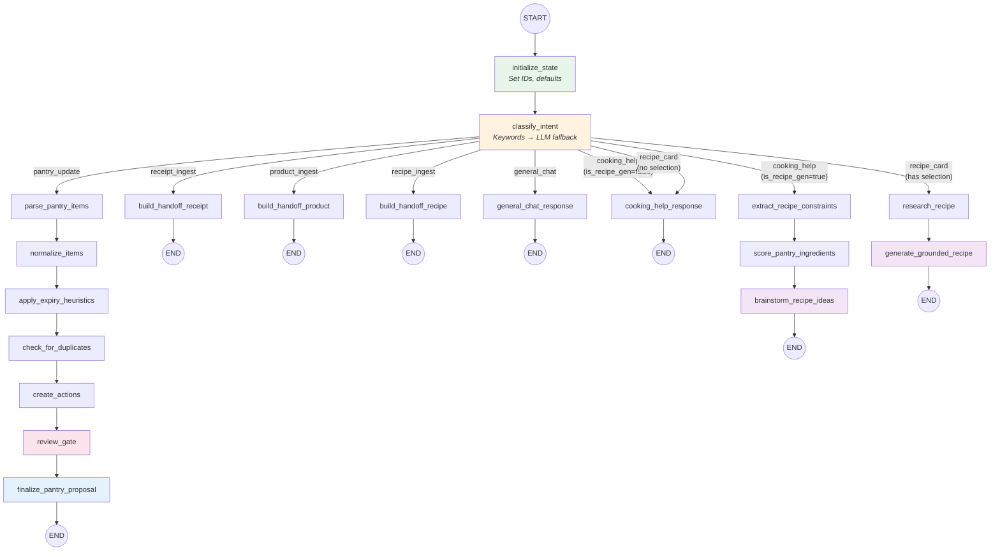
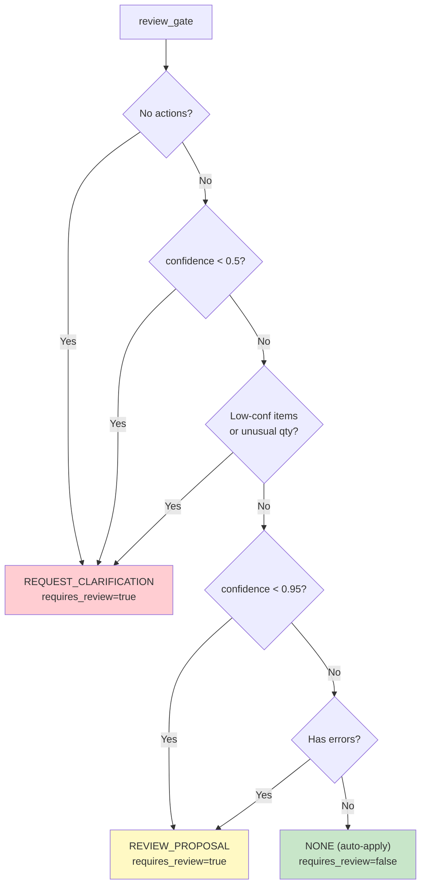
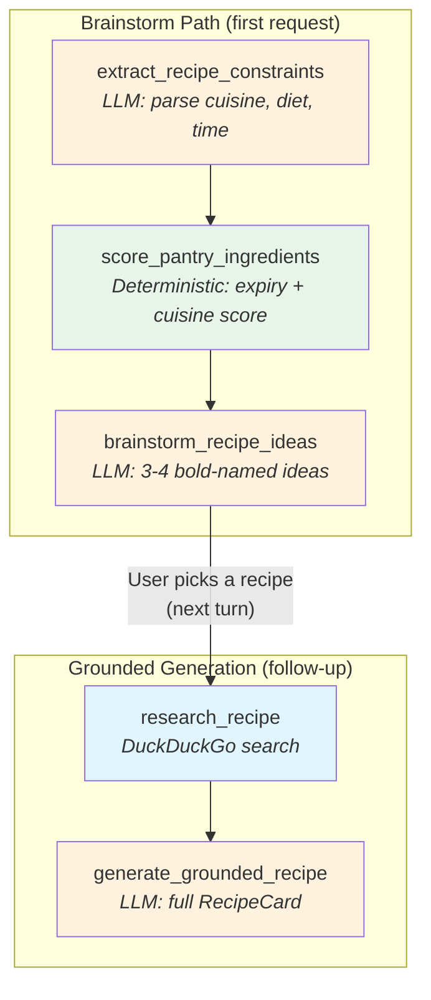
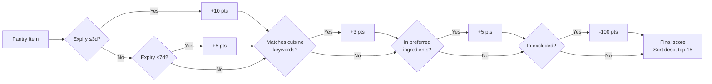
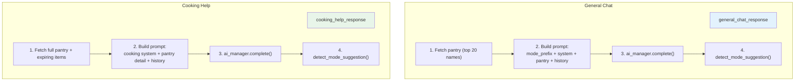
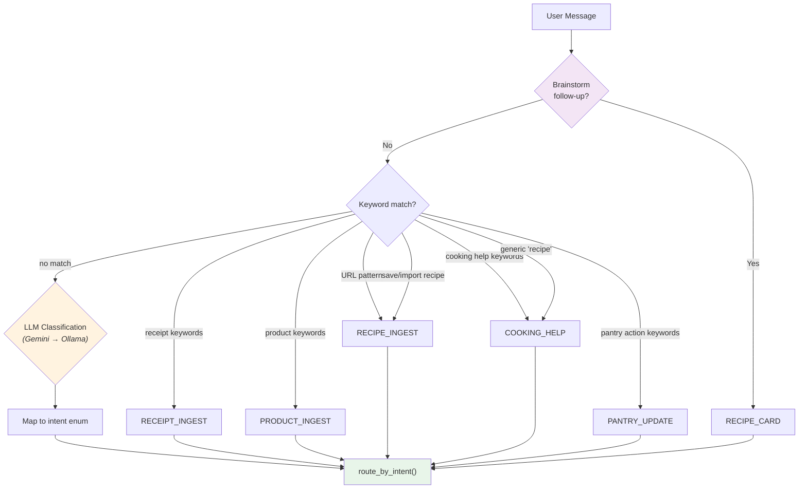
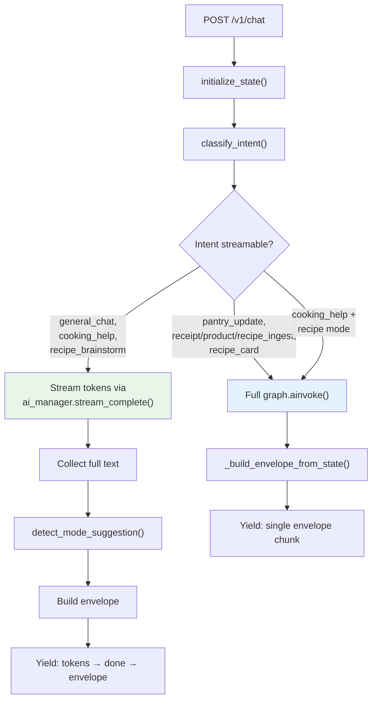

# BubblyChef Workflow Diagrams (Post-R1 Refactor)

> Mermaid diagrams of the actual LangGraph workflows as implemented in code.
> Generated from `workflows/router.py`, `workflows/pantry/nodes.py`,
> `workflows/recipe/nodes.py`, `workflows/chat/nodes.py`.

---

## 1. Parent Router Graph

The top-level graph that all `/v1/chat` requests flow through.

**Source:** `workflows/router.py` — `build_chat_router_graph()`

---

## 2. Pantry Sub-Graph (Pipeline)

Linear deterministic pipeline — only `parse_pantry_items` calls the LLM.

**Source:** `workflows/pantry/nodes.py`

```mermaid
graph LR
    parse["parse_pantry_items<br/><i>LLM: extract items</i>"]
    norm["normalize_items<br/><i>Rule-based name cleanup</i>"]
    exp["apply_expiry_heuristics<br/><i>Category → shelf life</i>"]
    dedup["check_for_duplicates<br/><i>Batch + pantry snapshot</i>"]
    act["create_actions<br/><i>Build PantryUpsertActions</i>"]
    gate["review_gate<br/><i>Confidence thresholds</i>"]
    fin["finalize_pantry_proposal<br/><i>Wrap as PantryProposal</i>"]

    parse --> norm --> exp --> dedup --> act --> gate --> fin

    style parse fill:#fff3e0
    style gate fill:#fce4ec
```

### Review Gate Decision Logic

---

## 3. Recipe Sub-Graph

Two paths: **brainstorm** (first request) and **grounded generation** (follow-up selection).

**Source:** `workflows/recipe/nodes.py`

### Pantry Scoring Algorithm

---

## 4. Chat Sub-Graph

Simple LLM call nodes with pantry context injection.

**Source:** `workflows/chat/nodes.py`

---

## 5. Intent Classification Flow

How `classify_intent` in `router.py` decides which path to take.

---

## 6. Streaming vs Non-Streaming

`run_chat_workflow_streaming()` in `router.py` decides whether to stream or batch.

---

## 7. Envelope Type by Intent

What `run_chat_workflow()` returns based on the classified intent.

| Intent | Envelope Type | Proposal | Next Action |
|--------|--------------|----------|-------------|
| `pantry_update` | `PantryProposal` | Items + actions | `REVIEW_PROPOSAL` or `REQUEST_CLARIFICATION` |
| `receipt_ingest` | `HandoffProposal(RECEIPT)` | None | `REQUEST_RECEIPT_IMAGE` |
| `product_ingest` | `HandoffProposal(PRODUCT)` | None | `REQUEST_PRODUCT_BARCODE` |
| `recipe_ingest` | `HandoffProposal(RECIPE)` | None | `REQUEST_RECIPE_TEXT` |
| `recipe_brainstorm` | General chat envelope | None | `PICK_RECIPE` |
| `recipe_card` | `RecipeCardProposal` | Full recipe | `REVIEW_PROPOSAL` |
| `cooking_help` | General chat envelope | None | `NONE` |
| `general_chat` | General chat envelope | None | `NONE` |

---

## File Map

| File | Lines | Role |
|------|-------|------|
| `workflows/router.py` | 1029 | Parent graph, classify, route, envelope build, streaming |
| `workflows/shared_state.py` | 417 | LLM schemas, envelope factories, sub-state TypedDicts |
| `workflows/state.py` | 134 | WorkflowState TypedDict + re-exports from shared_state |
| `workflows/pantry/nodes.py` | 508 | 7 pantry pipeline nodes |
| `workflows/recipe/nodes.py` | 679 | Recipe constraints, brainstorm, research, grounded gen |
| `workflows/chat/nodes.py` | 329 | General chat + cooking help nodes |
| `workflows/chat_ingest.py` | 23 | Backward-compat shim (re-exports only) |
